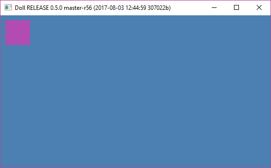

# Doll (Game Engine)

Doll is a general purpose game engine library written in C++.


## Installing under msys2

If you're on Windows and using msys2, then you can add the
[Axia msys2 package repository](https://github.com/axia-sw/msys2-packages) to
your package sources, and install with:

```
pacman -S doll
```


## Building

How to build from source, in case you want or need to:

```
# Assuming you're in the Doll source folder:
mkdir build
cd build
cmake -G Ninja -DDOLL_BUILD_VARIANT=RELEASE ..
```

If you plan to work on Doll directly, you should set the build variant to
`DEVELOPMENT`. Otherwise you should choose `DEBUG` or `RELEASE`.


## Quick example

`test-doll.cpp`:

```cpp
// Include Doll in our quick test program
#include <doll/Doll.hpp>

// Doll puts everything it has in the `doll` namespace
using namespace doll;

// Main part of our program
int main() {
	// Initialize or hard fail
	if( !doll_init() ) {
		return EXIT_FAILURE;
	}

	// Give us pretty console output
	core_installConsoleReporter();

	// Main loop
	do {
		// Grab a handle to the default rendering layer
		RLayer *const defLayer = gfx_getDefaultLayer();

		// Get the size of the layer, which is how big the screen is
		const int w = gfx_getLayerSizeX(defLayer);
		const int h = gfx_getLayerSizeY(defLayer);

		// Clear out our current rendering commands
		gfx_clearQueue();

		// Draw a pretty backdrop
		gfx_ink( doll_rgb(0.3f,0.5f,0.7f) );
		gfx_box( 0, 0, w, h );

		// Draw a pretty box
		gfx_ink( doll_rgb(0.7f,0.3f,0.7f) );
		gfx_box( 10, 10, 60, 60 );
	// Update or fail
	} while( doll_sync() );

	// Finish up and exit
	doll_fini();
	return EXIT_SUCCESS;
}
```

Build and run with: `g++ -o test-doll test-doll.cpp -lDoll && ./test-doll`

Output:

<span style="center">



</span>


## License

ZLib. See [License.md](License.md) for more details.

Informally, this license grants you the ability to use the code without having a
legal burden to provide credit for having used it in products you release.
However, you cannot claim that you wrote the original code, and any changes to
the code must be marked as such if you distribute said code.

There are some exceptions to this. For instance, the axlibs are all public
domain.
